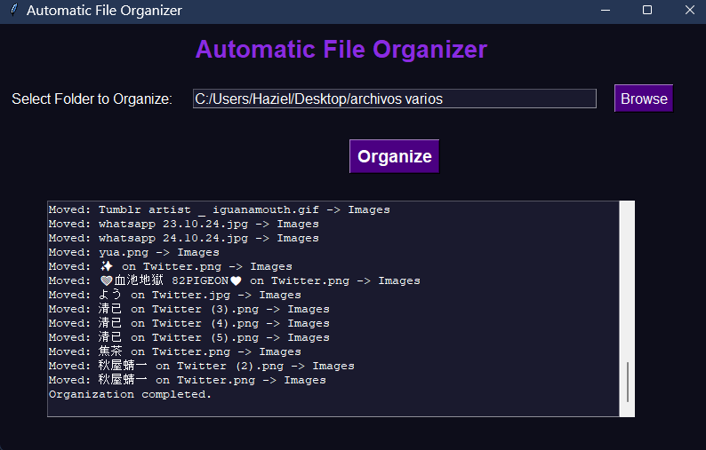

# Automatic File Organizer



A Python-based file organizer with a sleek purple-themed GUI. It automatically organizes files into folders based on their type (e.g., images, documents, music).

## Features
- Organizes files into customizable categories.
- Logs all actions for easy tracking.
- User-friendly GUI.

## How to Use
1. Clone this repository:
   ```bash
   git clone https://github.com/Haziel Cancino/Automatic-File-Organizer.git
